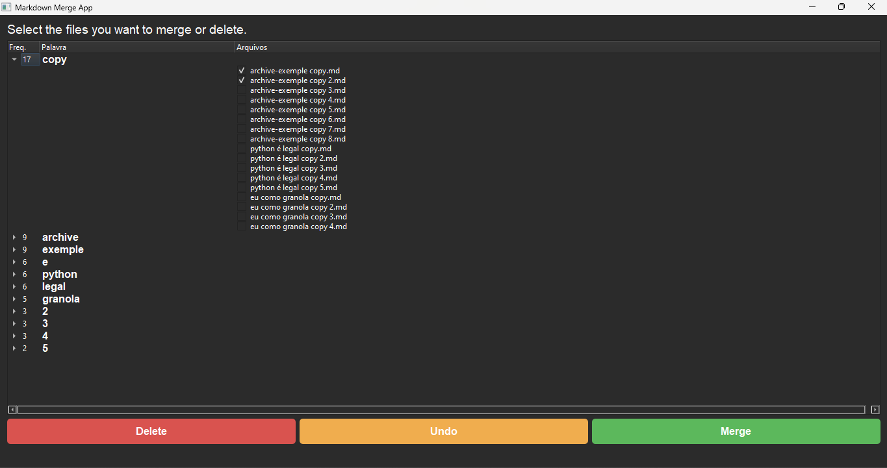

### **English Version**

# Markdown Merge App

## **Overview**

**Markdown Merge App** is a user-friendly graphical application designed to help you efficiently merge and manage multiple Markdown (`.md`) files. The application groups files based on common significant words, allowing you to select multiple files for merging or deletion with ease. It features a dark-themed interface and supports both English and Portuguese (Brazilian) languages.

## **Features**

- **Language Selection:** Choose between English and Portuguese (Brazilian) at startup.
- **Dark Theme:** Enjoy a sleek, dark-themed user interface.
- **File Grouping:** Files are grouped based on common significant words, sorted by frequency.
- **Merge Functionality:**
  - Select multiple files from different groups.
  - Receive suggested names for the merged file based on selected files.
  - Merge selected files into a new `.md` file.
  - Automatically back up original files and remove them after merging.
  - If a merged file name already exists, it will be replaced by the new one.
- **Delete Functionality:** Easily delete selected files by moving them to a backup folder.
- **Undo Feature:** Revert the last action (merge or delete) to restore original files.
- **Feedback System:** Receive clear feedback on operations performed.

## **Installation**

### **Prerequisites**

- **Python 3.x** installed on your system.
- **PyQt5** library installed.

### **Installing PyQt5**

Open your terminal or command prompt and run:

```bash
pip install PyQt5
```

## **Usage**

1. **Download the Script:**
   - Save the `merge_md_gui.py` script to your desired directory.

2. **Run the Application:**
   - Navigate to the directory containing the script using your terminal or command prompt.
   - Execute the script with Python:

     ```bash
     python merge_md_gui.py
     ```

     *If `python` command doesn't work, try `py`:*

     ```bash
     py merge_md_gui.py
     ```

3. **Select Language:**
   - Upon launching, a dialog will prompt you to select your preferred language (**English** or **Portuguese (Brazilian)**). English is set as the default.

4. **Select Markdown Files:**
   - A directory selection dialog will appear. Choose the folder containing your `.md` files.
   - **Important:** Ensure that your `.md` files are named with meaningful words to facilitate effective grouping.

5. **Interact with the File Tree:**
   - The application displays a tree structure where:
     - **Parent Nodes:** Common significant words sorted by frequency.
     - **Child Nodes:** Individual `.md` files with checkboxes.
   - **Selecting Files:**
     - Check the boxes next to the files you wish to merge or delete. You can select multiple files across different groups.

6. **Perform Actions:**
   - **Merge Files:**
     - Select the desired files and click the **Merge** button.
     - A dialog will suggest a name for the merged file based on selected files. You can choose a suggestion or enter a custom name.
     - Confirm to merge. Original files will be backed up and removed.
   - **Delete Files:**
     - Select the desired files and click the **Delete** button.
     - Files will be moved to a backup folder and removed from the main directory.
   - **Undo Last Action:**
     - Click the **Undo** button to revert the last merge or delete action.

7. **Feedback:**
   - All operations provide feedback in the designated area at the bottom of the application, informing you of successful actions or any errors encountered.

## **Backup and Safety**

- **Backup Folder:** All deleted or merged original files are moved to a `.backup_merge_md` folder within the selected directory.
- **Undo Feature:** Allows you to restore the last action, ensuring you can recover files if needed.
- **Recommendation:** Always ensure you have backups of your important files before performing bulk operations.

## **Customization and Extensions**

- **Stopwords List:** The application uses a predefined list of stopwords in both English and Portuguese. You can customize this list within the script to better suit your specific use case.
- **Adding More Languages:** The application structure supports easy addition of more languages by extending the `LANGUAGES` dictionary.
- **Enhanced NLP Features:** For more advanced word analysis, integrating NLP libraries like `spaCy` or `NLTK` is recommended.

## **Troubleshooting**

- **No `.md` Files Found:**
  - Ensure that the selected directory contains `.md` files.
  - Verify that file extensions are correct (e.g., `.md` in lowercase).

- **Permission Errors:**
  - Run the application with appropriate permissions, especially if dealing with system directories.

- **Application Crashes:**
  - Ensure that all dependencies are correctly installed.
  - Check for any updates or patches to the script.

## **Contributing**

Contributions are welcome! Feel free to open issues or submit pull requests to enhance the application's features or language support.

## **License**

This project is open-source and available under the [MIT License](https://opensource.org/licenses/MIT).

---

### **Versão em Português (Brasil)**

# Aplicativo de Mesclagem de Markdown

## **Visão Geral**

O **Aplicativo de Mesclagem de Markdown** é uma aplicação gráfica amigável projetada para ajudá-lo a mesclar e gerenciar múltiplos arquivos Markdown (`.md`) de forma eficiente. O aplicativo agrupa arquivos com base em palavras comuns significativas, permitindo que você selecione múltiplos arquivos para mesclagem ou exclusão com facilidade. Ele apresenta uma interface com tema escuro e suporta os idiomas Inglês e Português (Brasil).

## **Recursos**

- **Seleção de Idioma:** Escolha entre Inglês e Português (Brasil) no início.
- **Tema Escuro:** Desfrute de uma interface elegante com tema escuro.
- **Agrupamento de Arquivos:** Os arquivos são agrupados com base em palavras comuns significativas, ordenados por frequência.
- **Funcionalidade de Mesclagem:**
  - Selecione múltiplos arquivos de diferentes grupos.
  - Receba sugestões de nomes para o arquivo mesclado com base nos arquivos selecionados.
  - Mescle arquivos selecionados em um novo arquivo `.md`.
  - Faça backup automático dos arquivos originais e remova-os após a mesclagem.
  - Se um nome de arquivo mesclado já existir, ele será substituído pelo novo.
- **Funcionalidade de Exclusão:** Exclua facilmente arquivos selecionados movendo-os para uma pasta de backup.
- **Funcionalidade de Desfazer:** Revertendo a última ação (mesclagem ou exclusão) para restaurar arquivos originais.
- **Sistema de Feedback:** Receba feedback claro sobre as operações realizadas.

## **Instalação**

### **Pré-requisitos**

- **Python 3.x** instalado em seu sistema.
- Biblioteca **PyQt5** instalada.

### **Instalando o PyQt5**

Abra seu terminal ou prompt de comando e execute:

```bash
pip install PyQt5
```

## **Uso**

1. **Baixar o Script:**
   - Salve o script `merge_md_gui.py` no diretório desejado.

2. **Executar o Aplicativo:**
   - Navegue até o diretório contendo o script usando seu terminal ou prompt de comando.
   - Execute o script com Python:

     ```bash
     python merge_md_gui.py
     ```

     *Se o comando `python` não funcionar, tente `py`:*

     ```bash
     py merge_md_gui.py
     ```

3. **Selecionar Idioma:**
   - Ao iniciar, um diálogo solicitará que você selecione o idioma preferido (**Inglês** ou **Português (Brasil)**). Inglês está definido como idioma padrão.

4. **Selecionar Arquivos Markdown:**
   - Um diálogo de seleção de diretório aparecerá. Escolha a pasta que contém seus arquivos `.md`.
   - **Importante:** Certifique-se de que seus arquivos `.md` estejam nomeados com palavras significativas para facilitar o agrupamento eficaz.

5. **Interagir com a Árvore de Arquivos:**
   - O aplicativo exibe uma estrutura em árvore onde:
     - **Nós Pais:** Palavras comuns significativas ordenadas por frequência.
     - **Nós Filhos:** Arquivos individuais `.md` com caixas de seleção.
   - **Selecionando Arquivos:**
     - Marque as caixas ao lado dos arquivos que deseja mesclar ou apagar. Você pode selecionar múltiplos arquivos em diferentes grupos.

6. **Realizar Ações:**
   - **Mesclar Arquivos:**
     - Selecione os arquivos desejados e clique no botão **Mesclar**.
     - Um diálogo sugerirá um nome para o arquivo mesclado com base nos arquivos selecionados. Você pode escolher uma sugestão ou inserir um nome personalizado.
     - Confirme para mesclar. Arquivos originais serão feitos backup e removidos.
   - **Apagar Arquivos:**
     - Selecione os arquivos desejados e clique no botão **Apagar**.
     - Os arquivos serão movidos para uma pasta de backup e removidos do diretório principal.
   - **Desfazer Última Ação:**
     - Clique no botão **Desfazer** para reverter a última ação de mesclagem ou apagamento.

7. **Feedback:**
   - Todas as operações fornecem feedback na área designada na parte inferior do aplicativo, informando sobre ações bem-sucedidas ou quaisquer erros encontrados.

## **Backup e Segurança**

- **Pasta de Backup:** Todos os arquivos apagados ou mesclados são movidos para uma pasta `.backup_merge_md` dentro do diretório selecionado.
- **Funcionalidade de Desfazer:** Permite restaurar a última ação realizada, garantindo que você possa recuperar arquivos se necessário.
- **Recomendação:** Sempre certifique-se de ter backups de seus arquivos importantes antes de realizar operações em lote.

## **Personalização e Extensões**

- **Lista de Stopwords:** O aplicativo usa uma lista pré-definida de stopwords em Inglês e Português. Você pode personalizar essa lista dentro do script para melhor atender ao seu caso de uso específico.
- **Adicionando Mais Idiomas:** A estrutura do aplicativo suporta a fácil adição de mais idiomas estendendo o dicionário `LANGUAGES`.
- **Recursos Avançados de NLP:** Para uma análise de palavras mais avançada, recomenda-se integrar bibliotecas de NLP como `spaCy` ou `NLTK`.

## **Solução de Problemas**

- **Nenhum Arquivo `.md` Encontrado:**
  - Verifique se o diretório selecionado contém arquivos `.md`.
  - Verifique se as extensões dos arquivos estão corretas (por exemplo, `.md` em letras minúsculas).

- **Erros de Permissão:**
  - Execute o aplicativo com permissões apropriadas, especialmente se estiver lidando com diretórios do sistema.

- **Aplicativo Crashando:**
  - Certifique-se de que todas as dependências estão corretamente instaladas.
  - Verifique por quaisquer atualizações ou patches para o script.

## **Contribuindo**

Contribuições são bem-vindas! Sinta-se à vontade para abrir issues ou enviar pull requests para aprimorar os recursos do aplicativo ou suporte a idiomas.

## **Licença**

Este projeto é de código aberto e está disponível sob a [Licença MIT](https://opensource.org/licenses/MIT).

---
